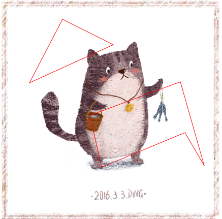

# vue-poly-canvas

[](https://www.npmjs.com/package/vue-poly-canvas)

> 基于canvas的多边形绘制组件

## Build Setup

``` bash
# install dependencies
npm install

# 运行项目
npm run dev

# 打包组件源代码
npm run build

# build for production and view the bundle analyzer report
npm run build --report
```

### 效果 :



点击左键开始绘制，点击右键完成一个多边形的绘制，可以绘制多个多边形。
可以返回绘制的多边形的各顶点坐标

### 如何使用 :
执行
``` bash
 npm install --save vue-poly-canvas
``` 
在页面中导入并定义即可使用
ts代码：
``` bash
import Canvas from "vue-poly-canvas";
@Component({
  components: {
    "u-canvas" : Canvas
  }
})
export default class App extends Vue {

}
```
html：
``` bash
<u-canvas :url="'http://img.zcool.cn/community/01f9ea56e282836ac72531cbe0233b.jpg@2o.jpg'">
</u-canvas>
```

以上是在ts的项目中的使用方法，js项目使用方式原理相同，代码不做实例


### 组件具体用法 :
Props： 
``` bash
url： 需要绘制多边形区域的背景图片url
index： 如果在一个页面中使用多个组件，则需要对每个组件传入不同的id，默认使用数字0。
``` 
methods：
``` bash
setAreas(areas: CanvasPoint[][])： 传入多边形顶点坐标数组，组件会将传入的多边形数据进行绘制，可以绘制多个多边形，areas参数类型为CanvasPoint[][]，如果不使用CanvasPoint类型，使用{x，y}这种json对象也可以。
deleteArea： 删除上一个绘制的多边形
``` 
events
``` bash
confirm： 确认绘制事件，参数类型为CanvasPoly，是基于CanvasPoint[][]的封装对象，一般用于将绘制的多边形数据传输给父组件。
``` 


